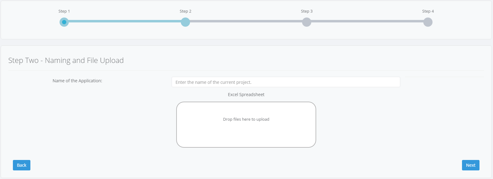

# SpreadsheetWeb Web Services Examples

SpreadsheetWeb is a platform for building and generating web applications and complex calculation engines from Excel models. The software is produced and distributed by Pagos Inc.

This repository contains a few samples that demonstrate how to build calculation-based web services using the SpreadsheetWeb platform. 

The SpreadsheetWeb Web Service is entirely based on an MS Excel calculation spreadsheet, and so you need to have one in order to create a Web Service. Each of the samples contain the corresponding MS Excel file.

## Download

If you have a `git` command line installed in your computer, you can download all of the samples by running:

```bash
> git clone https://github.com/spreadsheetweb/samples-web-services
```

Alternatively, you can click the `Clone or Download` button on the GitHub page.

## How to run

### Use a Web Service running at calculators.pagos.com

To make it easier for you we already uploaded MS Excel files from the samples to a [calculators.pagos.com](https://calculators.pagos.com), so you can quickly run client applications without a need of creating the Web Service by yourself. 

Just go to sample's *Client* directory to see how to launch them.
   
### Use a Web Service running at your own SpreadsheetWeb Server

Independently, if you have an active [SpreadsheetWeb Server Package](https://www.spreadsheetweb.com/server-pricing/) you may also create your own Web Service by uploading the MS Excel file from the samples. For this you need to do the following:

1. create a **Web Service** application. See [this link](https://pagosinc.atlassian.net/wiki/spaces/SSWEB/pages/35333/Web+Services) for additional details. You will be prompted to upload an MS Excel calculation file when creating the application (i.e. *Test Calculator/Test calculator.xlsx*)
 
    

    Drop the file into the corresponding box, as shown in the screenshot above.

2. Submit the application to the SpreadsheetWeb system (i.e. *Save* button).
4. Run client application in order to call the Web Service. You may use one of the examples from the *Client* folder, but please remember to modify the Web Service URL that the client sample is using (by default it tries to call [calculators.pagos.com](https://calculators.pagos.com), so if you have created your own Web Service, please edit the client's application code and replace the host "calculators.pagos.com" with your own URL).


## Examples Description

### Mortgage Test Calculator

Simple mortgage calculator