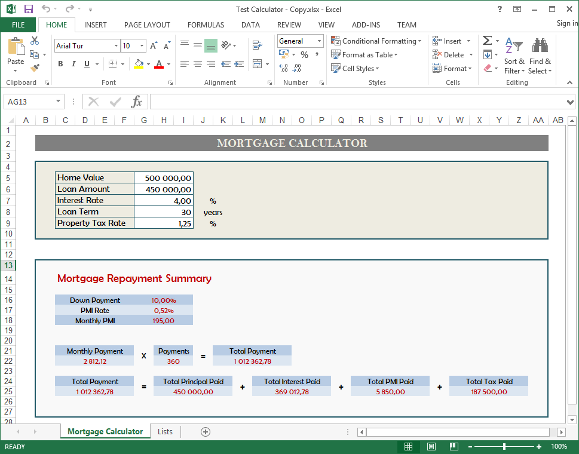

This is one of the samples that demonstrates how to build calculation-based web services using the SpreadsheetWeb platform. 

The *Test Calculator.xlsx* file is a simple mortgage calculator. When uploaded to a SpreadsheetWeb Web Service Application, it will use be used as a Web Service. 

To see it in action you need to run the client application which would call the Web Service and get some response.

For detailed information of how to create and call a SpreadsheetWeb Web Service by using this sample - please refer to the [README.md](../../../README.md) located under the root of this repository.

